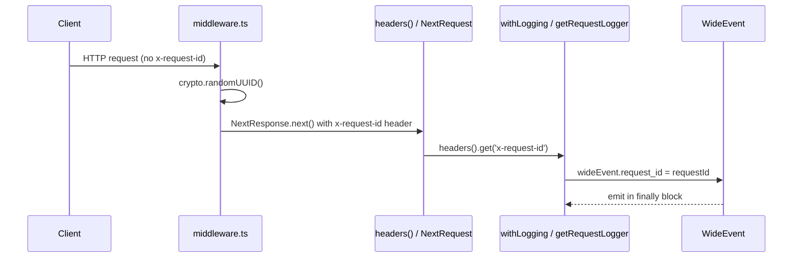

# Design Document: Production Logging

## Overview

This document describes the design for introducing production-grade structured logging to the Next.js 15 application using the **wide events** (canonical log lines) pattern. The goal is to replace scattered `console.log()` calls with a single pino logger instance that emits one context-rich JSON event per request, covering all server-side execution paths.

The system is built around two complementary patterns that address a fundamental constraint of the Next.js App Router: React Server Components cannot receive injected context from traditional middleware, so API routes and SSR pages require different instrumentation approaches.

**Key design decisions:**

- **pino** as the single logger — low overhead, JSON-first, pino-pretty for development
- **Wide events** — one structured JSON object built throughout a request, emitted once in a `finally` block
- **`withLogging` HOF** — wraps API route handlers, owns the wide event lifecycle
- **`getRequestLogger`** — async helper for SSR pages and server components, reads `x-request-id` from `headers()`
- **Middleware** — injects `x-request-id` UUID on every matched request so all downstream code shares a stable correlation ID
- **Utility functions** — accept an optional `wideEvent` param and write sub-objects rather than emitting separate log lines

---

## Architecture

```mermaid
flowchart TD
    Client([HTTP Client])

    subgraph Next.js Edge / Node Runtime
        MW[src/middleware.ts\nwithAuth + x-request-id injection]
    end

    subgraph API Route path
        WL[withLogging HOF\nsrc/lib/withLogging.ts]
        AR[API Route Handler\nsrc/app/api/**]
    end

    subgraph SSR Page path
        GRL[getRequestLogger\nsrc/lib/getRequestLogger.ts]
        SSR[SSR Page / Server Component\nsrc/app/events, /admin, etc.]
    end

    subgraph Shared utilities
        UF[Utility Functions\nsrc/utils/getEvents, getInfos, etc.]
        ENV[src/lib/env.ts\nZod env schema]
        LOG[src/lib/logger.ts\npino singleton]
    end

    Client -->|HTTP request| MW
    MW -->|sets x-request-id header| WL
    MW -->|sets x-request-id header| GRL

    WL -->|wraps| AR
    AR -->|enriches wideEvent| WL
    AR -->|calls with wideEvent| UF

    GRL -->|returns wideEvent + emit| SSR
    SSR -->|enriches wideEvent| GRL
    SSR -->|calls with wideEvent| UF

    UF -->|writes sub-objects to wideEvent| AR
    UF -->|writes sub-objects to wideEvent| SSR

    WL -->|logger.info(wideEvent)| LOG
    GRL -->|logger.info(wideEvent)| LOG
    UF -->|logger.info for background tasks| LOG

    ENV -->|validates env vars| LOG
    LOG -->|stdout JSON / pino-pretty| STDOUT([stdout])
```

### Request ID Flow



---

## Components and Interfaces

### `src/lib/logger.ts`

Single pino logger instance. Configured once at process startup; all other modules import from here.

```typescript
import pino from 'pino';

export const logger = pino({
  level: process.env.LOG_LEVEL ?? 'info',
  formatters: {
    level: (label) => ({ level: label }),
  },
  base: {
    service:      process.env.SERVICE_NAME    ?? 'cpv-app',
    version:      process.env.SERVICE_VERSION ?? 'unknown',
    commit_hash:  process.env.COMMIT_SHA      ?? 'unknown',
    node_version: process.version,
    environment:  process.env.NODE_ENV        ?? 'production',
  },
  ...(process.env.NODE_ENV === 'development' && {
    transport: {
      target: 'pino-pretty',
      options: { colorize: true },
    },
  }),
});
```

**Log level conventions:**

| Level   | When to use |
|---------|-------------|
| `trace` | Individual SQL query parameters, granular I/O |
| `debug` | Verbose diagnostics useful during investigation |
| `info`  | All wide events (success and expected errors) |
| `warn`  | Recoverable anomalies: cache miss forcing cold fetch, deprecated usage |
| `error` | Unexpected failures causing 5xx or unhandled exceptions |
| `fatal` | Process-level failures: DB connection failure at startup, missing required env var |

---

### `src/middleware.ts`

Extends the existing `withAuth` middleware to inject `x-request-id` on every matched request.

```typescript
import { withAuth } from 'next-auth/middleware';
import { NextResponse } from 'next/server';
import { v4 as uuidv4 } from 'uuid';

export default withAuth(
  function middleware(req) {
    const requestId = req.headers.get('x-request-id') ?? uuidv4();
    const response = NextResponse.next();
    response.headers.set('x-request-id', requestId);
    return response;
  },
  {
    callbacks: {
      authorized({ req, token }) {
        // ... existing authorization logic unchanged
      },
    },
  }
);
```

The `x-request-id` is set on the **response** headers so that Next.js propagates it into the request headers store accessible via `headers()` in server components and route handlers.

---

### `src/lib/withLogging.ts`

Higher-order function that wraps a Next.js API route handler. Owns the full wide event lifecycle for the API route path.

```typescript
import { NextRequest, NextResponse } from 'next/server';
import { getNextAuthSession } from '@/utils/auth';
import { logger } from './logger';

export type WideEvent = Record<string, unknown>;

type RouteHandler = (
  req: NextRequest,
  ctx: { params: Promise<Record<string, string>>; wideEvent: WideEvent },
) => Promise<NextResponse | Response>;

export function withLogging(handler: RouteHandler): RouteHandler {
  return async (req, ctx) => {
    const startTime = Date.now();
    const requestId = req.headers.get('x-request-id') ?? crypto.randomUUID();

    const wideEvent: WideEvent = {
      request_id: requestId,
      timestamp:  new Date().toISOString(),
      method:     req.method,
      path:       req.nextUrl.pathname,
    };

    let response: NextResponse | Response | undefined;

    try {
      const session = await getNextAuthSession();
      wideEvent.user = session?.user
        ? { id: session.user.id, role: session.user.role }
        : null;

      response = await handler(req, { ...ctx, wideEvent });

      wideEvent.status_code = response.status;
      wideEvent.outcome     = response.status < 400 ? 'success' : 'error';
      return response;
    } catch (err) {
      const error = err instanceof Error ? err : new Error(String(err));
      wideEvent.status_code = 500;
      wideEvent.outcome     = 'error';
      wideEvent.error       = { message: error.message, type: error.name };
      throw err;
    } finally {
      wideEvent.duration_ms = Date.now() - startTime;
      logger.info(wideEvent);
    }
  };
}
```

**Usage in an API route:**

```typescript
// src/app/api/admin/acceptuser/route.ts
export const POST = withLogging(async (req, { wideEvent }) => {
  const body = await req.json();
  // allowlist fields — never spread the whole body
  wideEvent.action   = 'accept_user';
  wideEvent.resource = { target_email_hash: hash(body.email) };
  // ...
});
```

---

### `src/lib/getRequestLogger.ts`

Async helper for SSR pages and server components. Reads `x-request-id` from Next.js `headers()` and returns a context object.

```typescript
import { headers } from 'next/headers';
import { logger } from './logger';

export type RequestLoggerContext = {
  wideEvent: WideEvent;
  emit:      () => void;
  startTime: number;
};

export async function getRequestLogger(page: string): Promise<RequestLoggerContext> {
  const headerStore = await headers();
  const requestId   = headerStore.get('x-request-id') ?? crypto.randomUUID();
  const startTime   = Date.now();

  const wideEvent: WideEvent = {
    request_id:  requestId,
    timestamp:   new Date().toISOString(),
    page,
    render_type: 'ssr',
  };

  function emit() {
    wideEvent.duration_ms = Date.now() - startTime;
    logger.info(wideEvent);
  }

  return { wideEvent, emit, startTime };
}
```

**Usage in an SSR page:**

```typescript
// src/app/events/page.tsx
export default async function EventsPage(props) {
  const { wideEvent, emit } = await getRequestLogger('/events');
  try {
    const events = await getEvents(page, 12, 'OUVERT', wideEvent);
    wideEvent.outcome      = 'success';
    wideEvent.event_count  = events.length;
    return <main>...</main>;
  } catch (err) {
    wideEvent.outcome = 'error';
    wideEvent.error   = { message: err.message, type: err.name };
    throw err;
  } finally {
    emit();
  }
}
```

---

### `src/utils/` — Utility Function Pattern

Utility functions accept an optional `wideEvent` parameter and write timing/result metadata as named sub-objects. They never emit their own log lines (except `getInfos` background refresh).

```typescript
// src/utils/getEvents.ts
export const getEvents = cache(
  async (
    page: string,
    eventPerPage: number,
    type: Type,
    wideEvent?: WideEvent,
  ) => {
    const start = Date.now();
    const res   = await prisma.event.findMany({ /* ... */ });

    if (wideEvent) {
      wideEvent.get_events = {
        duration_ms: Date.now() - start,
        count:       res.length,
        page:        Number(page),
        type,
      };
    }

    return res;
  },
);
```

```typescript
// src/utils/getInfos.ts — background refresh uses logger directly
import { logger } from '@/lib/logger';

after(async () => {
  logger.info({ action: 'cache_refresh', resource: 'infos.json', outcome: 'started' });
  const start  = Date.now();
  const infos  = await fetchInfos();
  await writeFile(path, JSON.stringify(infos));
  logger.info({ action: 'cache_refresh', resource: 'infos.json', outcome: 'completed', duration_ms: Date.now() - start });
});
```

---

### `src/lib/env.ts` — Extended Zod Schema

```typescript
const EnvSchema = z.object({
  // ... existing fields ...
  LOG_LEVEL:       z.string().optional(),
  SERVICE_NAME:    z.string().optional(),
  SERVICE_VERSION: z.string().optional(),
  COMMIT_SHA:      z.string().optional(),
});
```

---

## Data Models

### `WideEvent` — API Route

```typescript
type WideEvent = {
  // Always present
  request_id:   string;          // UUID v4
  timestamp:    string;          // ISO 8601
  duration_ms:  number;          // set in finally block
  outcome:      'success' | 'error';
  // From logger base fields (added automatically by pino)
  service:      string;
  environment:  string;
  node_version: string;
  version:      string;
  commit_hash:  string;

  // API route specific
  method:       string;          // 'GET' | 'POST' | ...
  path:         string;          // '/api/admin/acceptuser'
  status_code:  number;

  // User context
  user: { id: string; role: string } | null;

  // Error (when outcome === 'error')
  error?: { message: string; type: string };

  // Business context (handler-specific sub-objects)
  [key: string]: unknown;
};
```

### `WideEvent` — SSR Page

```typescript
type WideEvent = {
  // Always present (same base fields as above)
  request_id:   string;
  timestamp:    string;
  duration_ms:  number;
  outcome:      'success' | 'error';

  // SSR specific
  page:         string;          // '/events', '/admin', etc.
  render_type:  'ssr';

  // Optional business context
  event_count?: number;
  pagination?:  { page: number; per_page: number; total: number };
  error?:       { message: string; type: string };

  [key: string]: unknown;
};
```

### `RequestLoggerContext`

```typescript
type RequestLoggerContext = {
  wideEvent: Record<string, unknown>;
  emit:      () => void;          // sets duration_ms and calls logger.info
  startTime: number;              // Date.now() at construction
};
```

### Utility Sub-Object Schema (examples)

```typescript
// wideEvent.get_events
{ duration_ms: number; count: number; page: number; type: string }

// wideEvent.get_infos
{ duration_ms: number; cache_hit: boolean }

// wideEvent.get_events_count
{ duration_ms: number; count: number; type: string }
```

---

## Security Considerations

### PII Exclusion

- `user.email`, `user.name`, `user.surname`, `user.password` are **never** written to any wide event
- Only `user.id` and `user.role` are permitted in the `user` sub-object
- Request bodies are **never** spread onto the wide event; handlers must explicitly allowlist fields
- Passwords and bcrypt hashes must never appear in any log call

### Allowlisting Pattern

```typescript
// WRONG — spreads entire body including password
wideEvent.body = body;

// CORRECT — explicit allowlist
wideEvent.registration = {
  role:   body.check ? 'WAITING' : 'USER',
  cercle: body.cercle ?? null,
};
```

### Error Serialisation

Raw `Error` objects, `undefined` values, and circular references must never be set on a wide event. Always serialise:

```typescript
wideEvent.error = { message: error.message, type: error.name };
```

---

## Error Handling

| Scenario | Behaviour |
|----------|-----------|
| Handler throws | `withLogging` catches, sets `outcome: 'error'`, `status_code: 500`, `error: {message, type}`, re-throws, emits in `finally` |
| SSR page data-fetch throws | Page catches in `try/catch`, sets `outcome: 'error'`, `error`, re-throws; `finally` calls `emit()` |
| `x-request-id` header absent | `withLogging` / `getRequestLogger` generate a fresh UUID as fallback |
| No session in `withLogging` | `wideEvent.user = null`, no throw |
| Utility called without `wideEvent` | Operates normally, no logging, backward compatible |
| Missing optional env var | Logger defaults apply; no startup failure |
| Missing required env var | `logger.fatal(...)` then `process.exit(1)` |

---

## Testing Strategy

### Dual Testing Approach

Both unit tests and property-based tests are required. Unit tests cover specific examples and integration points; property tests verify universal correctness across all inputs.

**Property-based testing library:** `fast-check` (TypeScript-native, works in Node.js without a test runner dependency)

**Unit test runner:** Jest or Vitest (whichever is already configured in the project)

### Unit Tests

- `logger.ts`: verify base fields are present in emitted JSON, verify pino-pretty transport is applied in development
- `withLogging`: verify wide event fields for a successful handler, a throwing handler, and a handler with no session
- `getRequestLogger`: verify `request_id` is read from headers, verify fallback UUID when header absent, verify `emit()` sets `duration_ms`
- `middleware.ts`: verify `x-request-id` is set on response when absent from request, verify existing header is preserved
- `getEvents` / `getInfos`: verify sub-objects are written to `wideEvent` when provided, verify no mutation when `wideEvent` is absent

### Property-Based Tests

Each property test must run a minimum of **100 iterations** and include a comment tag in the format:

```
// Feature: production-logging, Property N: <property text>
```

